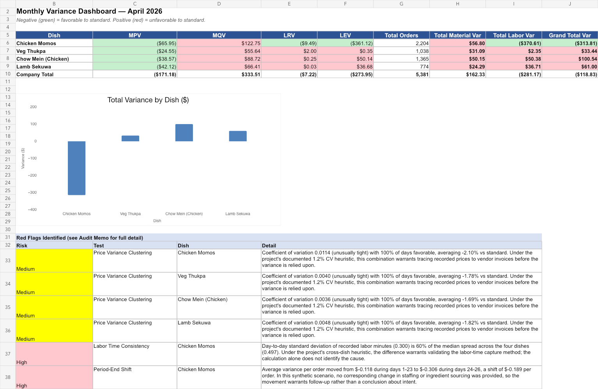

# Streets of Nepal — Standard Costing Variance Analysis with Audit Red-Flag Detection



A reproducible standard costing and variance analysis project built around a fictional fast-casual
Nepalese restaurant, designed to demonstrate both core cost accounting mechanics and
an applied internal-audit lens on top of them.

## Why this project exists

Standard variance calculations (material price/quantity, labor rate/efficiency) are
built into virtually every ERP and accounting platform. The differentiator isn't
computing the variance — it's knowing what the numbers mean, when a "good" result
should make you more suspicious rather than less, and how to communicate that finding
to management. This project builds the calculation engine from scratch and then layers
a forensic/controls review on top of it, the way an internal auditor or GRC analyst
would actually use the output.

## The scenario

Streets of Nepal tracks standard costs for four signature dishes (Chicken Momos, Veg
Thukpa, Chow Mein, Lamb Sekuwa) and reviews actual-to-standard variance monthly. The
kitchen manager receives a bonus tied to a favorable monthly food cost variance — a
common incentive structure that also creates a textbook motive to manage the numbers
rather than the underlying costs.

A month of daily actual data (26 operating days) was synthetically generated with
realistic operational noise, plus three deliberately embedded anomalies concentrated
in the bonus-linked dish, to test whether a variance review process would actually
catch them.

## What's in this repo

| File | Purpose |
|---|---|
| `generate_data.py` | Generates the synthetic daily actuals dataset (`data/daily_actuals.csv`) |
| `variance_analysis.py` | Calculates MPV, MQV, LRV, LEV from the actuals and runs three statistical red-flag tests |
| `build_excel.py` | Builds the live-formula Excel workbook (standard cost cards, daily data, variance calcs, dashboard) |
| `build_memo.js` | Generates the formal audit memo (Word doc) summarizing findings, risk ratings, and recommendations |
| `outputs/Streets_of_Nepal_Variance_Analysis.xlsx` | The Excel deliverable |
| `outputs/Streets_of_Nepal_Audit_Memo.docx` | The Word audit memo deliverable |

All data is synthetic. The workbook and memo can be regenerated from a fresh clone.

## Reproduce the project

From this folder, run:

```bash
python -m pip install -r requirements.txt
npm install
python generate_data.py
python variance_analysis.py
python build_excel.py
npm run build:memo
```

The scripts create `data/` and `outputs/` automatically. Dependency versions are declared in `requirements.txt` and `package.json`.

## Methodology

**Variance formulas** (standard cost accounting):
- Material Price Variance = (Actual Price − Standard Price) × Actual Quantity
- Material Quantity Variance = (Actual Quantity − Standard Quantity) × Standard Price
- Labor Rate Variance = (Actual Rate − Standard Rate) × Actual Hours
- Labor Efficiency Variance = (Actual Hours − Standard Hours) × Standard Rate

**Red-flag detection heuristics** (applied on top of the standard variances):
1. **Price clustering test** — flags dishes where actual material prices are
   favorable nearly every day and fall below the scenario's documented dispersion
   threshold, prompting comparison to vendor invoices.
2. **Labor time consistency test** — compares the day-to-day standard deviation of
   recorded labor minutes across dishes; a dish with implausibly low variability
   relative to its peers suggests time entries may not be captured independently
   each day.
3. **Period-end shift test** — compares variance favorability in the final days of
   the month (just before the bonus review date) to the rest of the month, looking
   for the kind of sudden, unexplained improvement associated with period-end
   metric management.

These thresholds are transparent portfolio assumptions designed for the synthetic scenario. They are not industry benchmarks, do not establish statistical significance, and do not prove manipulation. Each flag is a prompt to inspect source documentation and ask follow-up questions.

## Result

The model surfaced six follow-up indicators. Four (price clustering) applied across all dishes and
point to a system/process-level issue in how purchase prices flow into the costing
system. Two (labor time consistency and period-end shift) were specific to Chicken
Momos — the dish tied to the kitchen manager's bonus — and raised related follow-up
questions through separate heuristics. The full findings, risk ratings, and
recommendations are written up in the audit memo.

## Tools used

Python (pandas, numpy) for data generation and analysis · openpyxl for the live-formula
Excel model · docx (Node.js) for the formal Word memo.

## Author

Sandesh Lama Tamang — B.B.A. Accounting & Computer Information Systems, University of
Louisiana Monroe. Built as part of a GRC / IT audit-focused portfolio.
