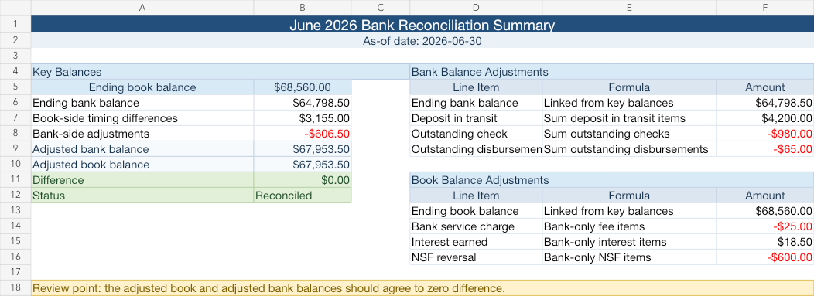

# Bank Reconciliation Case Study

A practical bank reconciliation example for month-end close that demonstrates matching bank statement activity to book cash records, identifying reconciling items, and producing clear documentation.

## Table of Contents
- [Project Goal](#project-goal)
- [Project Scenario](#project-scenario)
- [Completed Deliverables](#completed-deliverables)
- [Files In This Project](#files-in-this-project)
- [Prerequisites](#prerequisites)
- [Data dictionary](#data-dictionary)
- [Suggested workflow / How to use](#suggested-workflow--how-to-use)
- [How matching works (summary)](#how-matching-works-summary)
- [Reconciliation outcome (sample)](#reconciliation-outcome-sample)
- [What to look for / common reconciling items](#what-to-look-for--common-reconciling-items)
- [Privacy & data handling](#privacy--data-handling)
- [Contributing / Contact](#contributing--contact)

## Project Goal
Demonstrate the ability to:
- Compare bank activity to book records and reconcile differences
- Identify outstanding checks and deposits in transit
- Detect bank fees, timing issues, and missing entries
- Document reconciling items and produce journal entries
- Support month-end close and ensure cash accuracy

## Project Scenario
This project simulates reconciliation of a company's cash ledger to a bank statement for a single month (June 2026). The objective is to match transactions that appear in both records, identify timing differences, and produce a complete reconciliation workbook for month-end close.

## Completed Deliverables
- book-side cash activity file
- bank statement activity file
- matched transactions schedule
- reconciling items schedule
- adjusted cash summary
- journal entries for bank-only items
- reconciliation notes and close follow-up points
- reconciliation workbook (Excel)

## Files In This Project
- [`sample_book_transactions.csv`](sample_book_transactions.csv) — book-side transactions used for reconciliation
- [`sample_bank_statement.csv`](sample_bank_statement.csv) — bank statement activity for the period
- [`matched_transactions.csv`](matched_transactions.csv) — completed matching schedule for the case study
- [`reconciling_items.csv`](reconciling_items.csv) — outstanding items and bank-only items
- [`adjusted_cash_summary.md`](adjusted_cash_summary.md) — summary of the adjusted cash balance
- [`journal_entries.md`](journal_entries.md) — suggested journal entries for book updates
- [`reconciliation-notes.md`](reconciliation-notes.md) — investigation notes and follow-ups
- [`bank-reconciliation-workbook.xlsx`](bank-reconciliation-workbook.xlsx) — workbook containing sheets for matching, reconciling items, and summary

## Prerequisites
- Excel (or equivalent) to open the workbook, or Python 3.8+ with pandas if you prefer an automated approach.
- CSV files must use ISO-style dates (YYYY-MM-DD) and numeric amounts (no currency symbols) for easiest processing.

## Data dictionary
Expected columns (both CSVs):
- date — transaction date (YYYY-MM-DD)
- description — brief description or memo
- amount — signed numeric amount (positive = deposit/credit, negative = withdrawal/debit)
- reference (optional) — check number or bank reference
- running_balance (optional) — ledger/bank running balance (not required for matching)

Note: If your book uses separate debit/credit columns, convert to a single signed amount column before importing.

## Suggested workflow / How to use
1. Open [`bank-reconciliation-workbook.xlsx`](bank-reconciliation-workbook.xlsx) in Excel:
   - Import [`sample_book_transactions.csv`](sample_book_transactions.csv) to the Book sheet.
   - Import [`sample_bank_statement.csv`](sample_bank_statement.csv) to the Bank sheet.
2. Review the completed matching sheet, then reproduce the matching logic using the source CSV files:
   - Sort both datasets by date and amount.
   - Perform automatic matching on exact date + amount.
   - Flag near-matches or duplicates for manual review.
3. Review unmatched items:
   - Classify as deposit in transit, outstanding check, bank fee, bank error, or missing book entry.
4. Prepare journal entries for book-side adjustments (see [`journal_entries.md`](journal_entries.md)).
5. Produce the adjusted cash summary and document the reconciliation in [`reconciliation-notes.md`](reconciliation-notes.md).

The included workbook is a completed case study rather than an automated matching application. A future automation enhancement is listed in the repository roadmap.

## How matching works (summary)
- Primary match: exact match on date and amount.
- Secondary inspection: matches on amount + nearby dates (±1-3 days) for timing differences.
- Manual review for duplicates, split payments, or partial matches.
- Tolerance: for small rounding differences, use a configurable cents tolerance (e.g., $0.01–$1.00 depending on context).

## Reconciliation outcome (sample)
- Reconciled the June 2026 cash activity to an adjusted cash balance of **$67,953.50**.
- Identified one deposit in transit and two outstanding book-side disbursements as timing differences.
- Identified three bank-only items that require book entries before close.
(See [`adjusted_cash_summary.md`](adjusted_cash_summary.md) and [`reconciling_items.csv`](reconciling_items.csv) for detailed line items.)

## What to look for / common reconciling items
- Outstanding checks: checks recorded in books but not yet cleared by the bank.
- Deposits in transit: receipts recorded in books near month-end not yet on the bank statement.
- Bank service fees and NSF (insufficient funds) items: bank-only transactions that require book adjustment.
- Interest income and direct debits: bank-only items to record in the books.
- Bank errors or reversed transactions: investigate with the bank if amounts or payees look incorrect.

## Privacy & data handling
- Do not commit real customer data or bank account numbers to this repo.
- Redact personal data and account numbers from sample files before committing.
- Use synthetic or anonymized sample data in public repositories.

## Contributing / Contact
- To propose improvements (scripts, automation, additional checks), open an issue or submit a pull request.
- Author / maintainer: Sandesh Lama Tamang ([SanDAce07](https://github.com/SanDAce07))
