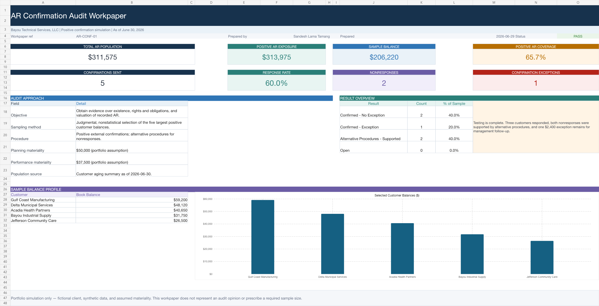

# AR Confirmation Simulation

A portfolio audit project demonstrating how accounts receivable confirmations are selected, controlled, followed up, and evaluated as substantive audit evidence.

## Project Goal

Build a recruiter-friendly audit workpaper package that shows how I can:

- reconcile a confirmation population to an AR aging source
- select a risk-based, nonstatistical sample
- prepare positive confirmation requests
- maintain auditor control over sending and responses
- perform alternative procedures for nonresponses
- document and evaluate confirmation exceptions
- conclude on the tested sample with clear control checks

## Project Scenario

This simulation uses Bayou Technical Services, LLC, a fictional client, and synthetic customer data as of June 30, 2026. The five largest positive customer balances were selected judgmentally because of their dollar value and aging profile. The sample covers $206,220, or 65.7% of the $313,975 positive AR exposure.

The scenario includes three customer responses, two nonresponses resolved through alternative procedures, and one $2,400 exception related to an unrecorded service-level credit memo.

## Completed Deliverables

- formula-driven Excel confirmation workpaper and audit summary
- positive-confirmation letter packet for all five sampled customers
- population and sample-selection schedule
- confirmation control and response log
- alternative-procedures schedule for nonresponses
- exception evaluation and management follow-up documentation
- reconciliation and data-quality control checks
- reusable synthetic CSV source files

## Files In This Project

- [AR_Confirmation_Workpaper_2026.xlsx](./AR_Confirmation_Workpaper_2026.xlsx)
- [AR_Confirmation_Letters_2026.docx](./AR_Confirmation_Letters_2026.docx)
- [confirmation_population.csv](./confirmation_population.csv)
- [confirmation_tracking.csv](./confirmation_tracking.csv)
- [alternative_procedures.csv](./alternative_procedures.csv)

## Workbook Features

1. `Audit Summary` — objective, scope, materiality assumptions, KPIs, and conclusion.
2. `AR Population` — complete customer population, aging risk, and selection flags.
3. `Sample Selection` — formula-linked sample balances, coverage, and rationale.
4. `Confirmation Log` — response tracking, differences, and final test result.
5. `Alternative Procedures` — support inspected for each nonresponse.
6. `Exceptions` — evaluation of the $2,400 credit-memo difference.
7. `Control Checks` — population tie-out, sample tie-out, nonresponse coverage, exception agreement, and overall model status.

## Audit Approach

- **Assertions:** existence, rights and obligations, and valuation/allocation
- **Procedure:** positive external confirmation with alternative procedures for nonresponses
- **Sampling:** judgmental, nonstatistical selection of the five largest positive balances
- **Planning materiality assumption:** $50,000
- **Performance materiality assumption:** $37,500
- **Conclusion:** Sample supported with one below-materiality exception requiring management follow-up

## Skills Demonstrated

- substantive audit testing
- external confirmation control
- audit sampling documentation
- alternative procedures
- exception evaluation
- workpaper cross-referencing
- Excel formulas, conditional formatting, and audit controls
- professional audit correspondence

## Important Disclaimer

This is a portfolio simulation using fictional entities and synthetic data. It is not an audit opinion, does not represent a live client engagement, and does not prescribe a required sample size under professional standards.
